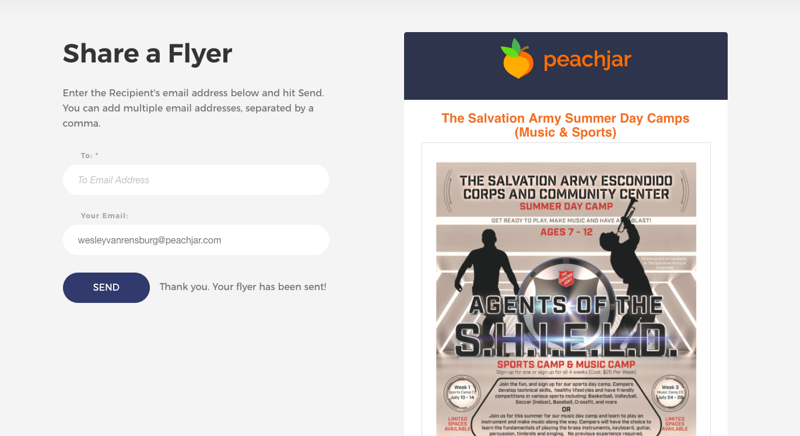

# High School Intern Project - Share a Flyer

## Requirements

Develop a HTML page that will take URL parameters, and present 2 input boxes and the image of a flyer that can be used to Share a Flyer. See the `final_result.png` for look and feel.



## Validation

##### To Email Address

The `To` email address field should have validation on it. This validation should be checked when a user hits the `Send` button. The allowed values for this field are single or multiple email addresses separated by comma's. See the below examples

```
email@domain.com
```
```
email1@domain.com, email2@domain.com,email3@domain.com
```

##### From Email Address

The `From` email address field should have validation on it. This validation should be checked when a user hits the `Send` button. The allowed values for this field is a single email addresses. See the below examples

```
email@domain.com
```

## Send Button

When a User hits the `Send` button, the following list of things should happen:

1. Validation of the 2 input fields
2. Ajax POST to the provided `api url` (see below) with the following parameters:
	3. 	toEmail
	4. fromEmail
	5. flyerId (prvided by in the URL as a parameter)
	6. flyerImageUrl (prvided by in the URL as a parameter)
7. Handle either the Error or Success by showing that message in the form

##### If a Success Occurs

Right next to the Send button, show a little message that says: `Thank you Your flyer has been shared!`

##### If an Error Occurs

Right next to the Send button, show a little message in RED that says: `There was an error sharing your Flyer. Please verify the To and From email address and try again.`

## Test API URLs

Below are 2 mock API's that can be used to test your work. 

####Testing a Successful API Response:

POST to:

```
http://www.mocky.io/v2/596e4ae20f00009c052b813e
```

Returns

```
{
   "result":"success",
   "error":null
}
```

####Testing an Error API Response:

POST to:

```
http://www.mocky.io/v2/596e4b070f000057052b8141
```

Returns

```
{
   "result":"error",
   "error":"bad formatted email address"
}
```

## URL

The following URL parameters will come through with the example below.

- `from`: This should auto populate the `from` email address field
- `flyerurl`: This will be the url to use to show the Flyer Image
- `flyertitle `: This will be the Flyer Title
- `flyerid`: This should go into a hidden input box so that it gets submitted when a user hits the Send button 

Example URL:

```
?from=wesleyvanrensburg%40peachjar.com&flyerurl=https%3A%2F%2Fcdn.peachjar.com%2F15003261116135-0.jpg&flyerid=123456&flyertitle=The%20Salvation%20Army%20Summer%20Day%20Camps%20%28Music%20%26%20Sports%29
```

## Test Flyer Image

```
https://cdn.peachjar.com/15003261116135-0.jpg
```


